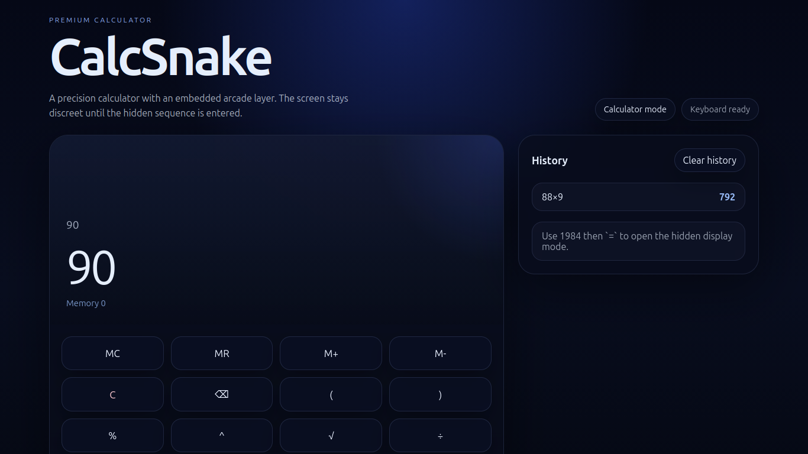
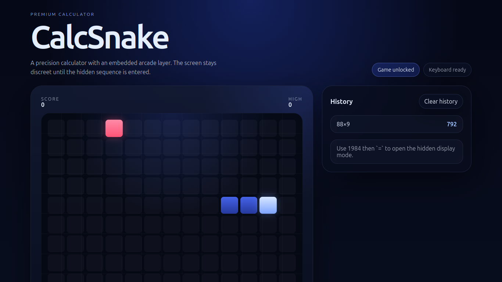

# CalcSnake

CalcSnake is a premium calculator experience built with React and Vite. It combines a modern scientific calculator, calculation history, and a hidden Snake game that uses the calculator display as the game surface.

## Features

- Full calculator with keyboard support
- Scientific operations: percent, square root, power, and parentheses
- Calculator memory controls: `MC`, `MR`, `M+`, and `M-`
- Calculation history panel with clear history action
- Clickable history results for quick reuse
- Error handling for invalid expressions
- Hidden Snake mode activated by entering `1984` and pressing `=`
- Snake controls with arrow keys and WASD
- Score and high score persistence with localStorage
- Pause, restart, and game over states
- Responsive layout with dark glassmorphism styling

## Installation

```bash
npm install
```

## Usage

```bash
npm run dev
```

Open the local development URL shown in the terminal.

## Screenshots





## Update Notes

### v1.1.0 - Calculator workflow update

- Added memory controls for storing, recalling, adding, and subtracting the active calculation value.
- Added a visible memory readout under the calculator display.
- Made calculation history entries clickable so previous results can be reused instantly.
- Bumped the app version to `1.1.0`.

## Roadmap

- Add sound effects for calculator and game events
- Expand scientific function coverage
- Add theme customization
- Add animated launch transitions

## License

Released under the MIT License. See [`LICENSE`](/home/yigit/CalcSnake/LICENSE).
